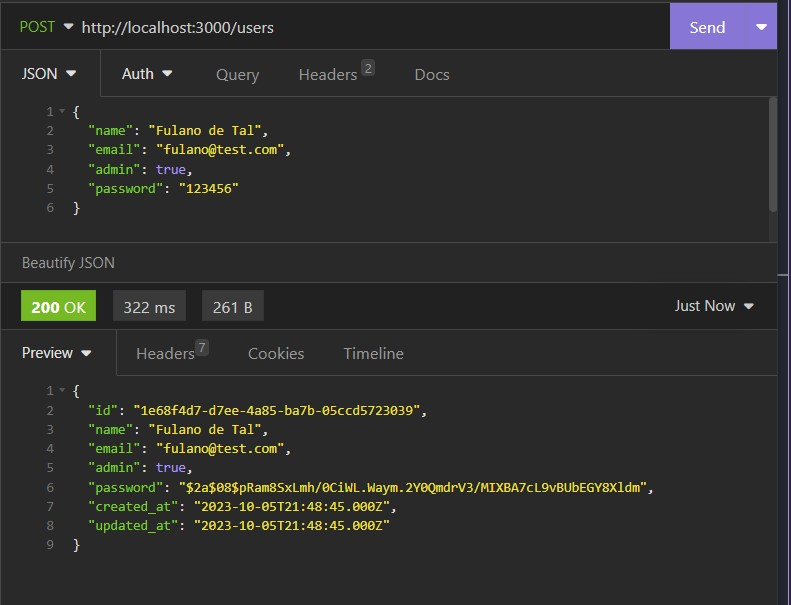
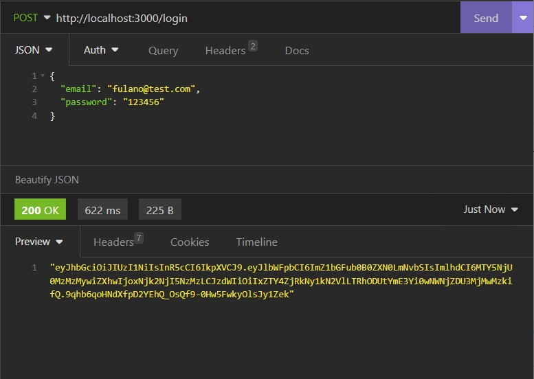
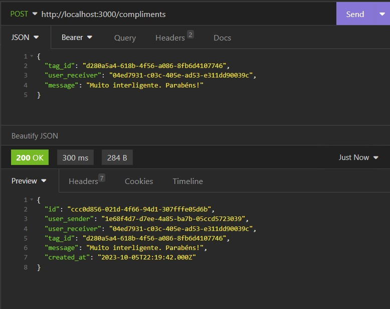
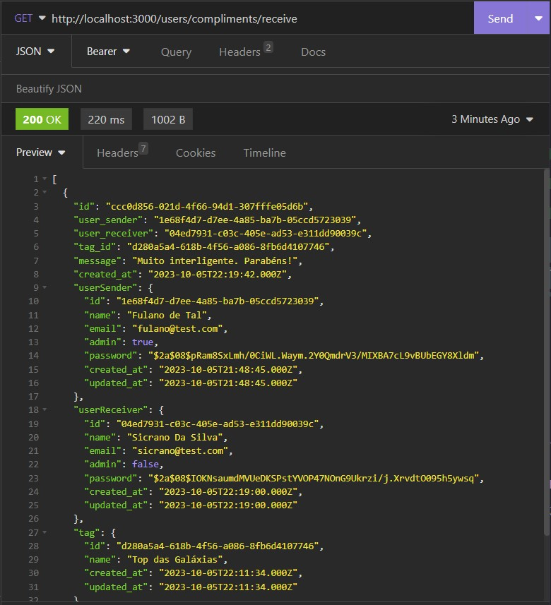
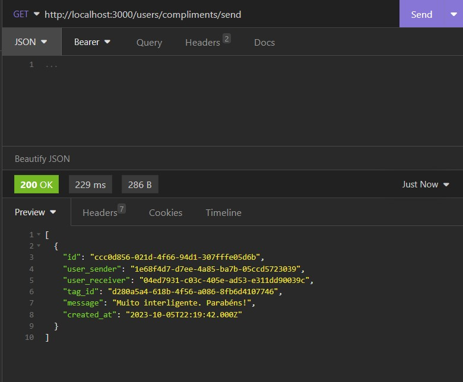

# NLW #6 - Valoriza

Projeto de uma API Rest desenvolvida durante a sexta edição do Next Level Week da [Rocketseat](https://github.com/rocketseat-education), o NLW Together, na trilha de NodeJS ministrada pela professora [Dani Leão](https://github.com/danileao).  

## Projeto

API Rest de um sistema para promover o reconhecimento entre companheiros de equipe através do envio de elogios entre os usuários.

## Tecnologias

- [Node.js](https://nodejs.org/en/)
- [Typescript](https://www.typescriptlang.org/)
- [Express](https://expressjs.com/pt-br/)
- [JSONWebToken](https://github.com/auth0/node-jsonwebtoken#readme)
- [TypeORM](https://typeorm.io/)
- [SQLite](https://www.sqlite.org/index.html)

## Como executar

- Clone o repositório
- Rode `yarn` para baixar as dependências
- Rode `yarn typeorm migration:run` para criar o banco de dados e as tabelas.
- Rode `yarn dev` para iniciar a aplicação.

Por fim, a aplicação estará disponível em `http://localhost:3000`. 

## Endpoints

### Criar usuário

`POST - /users`

### Realizar Login

`POST - /login `

### Criar Tag

`POST - /tags` 

### Criar Elogio

`POST - /compliments`

### Listar Elogios Recebidos do Usuario logado

`GET - /users/compliments/receive`

### Listar Elogios Enviados do Usuário logado
`GET - /users/compliments/send`

